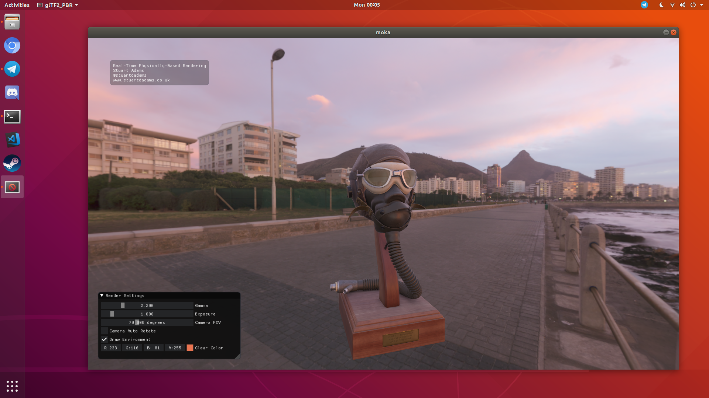

# moka
Cross-Platform Real-Time Physically-Based Rendering for C++! glTF-friendly!

As of 25/08/2019, the Hunter Package manager project has been closed. This project will be updated to use vcpkg soon!

Example Renders:

Support for Windows & Ubuntu!

